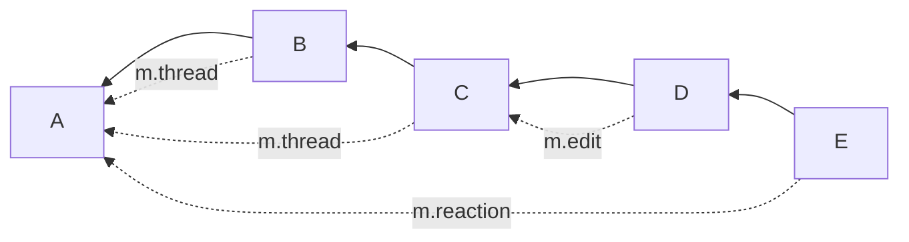

Originally reported at vector-im/element-web#23451, info from @gsouquet.

If you have a DAG that looks something like this:

The root event (and any other reactions, etc. to it) are shown both in the "main" timeline and as part of the thread. It is desirable for clients to be able to send a receipt in either of those. E.g. looking at a "thread" which shows `A` (as the root) and the reaction to it (`E`) and are trying to send a receipt for `E`.
